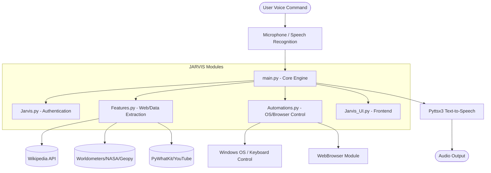
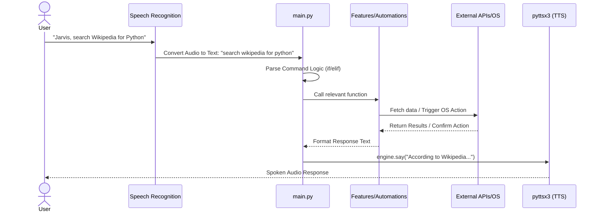

<div align="center">
  <h1>🤖 JARVIS-Python-GUI-Assistant</h1>
  <p>Your Personal AI Assistant with a slick GUI. Voice recognition, natural language processing, and task automation. Get organized and simplify tasks.</p>

  [](https://www.python.org/)
  [](LICENSE)
  []()
</div>

---

## 📖 Table of Contents

- [Description](#-description)
- [System Architecture](#-system-architecture)
- [Execution Flow](#-execution-flow)
- [Key Features](#-key-features)
  - [Core AI](#core-ai)
  - [Automations](#automations)
  - [Utilities & Information](#utilities--information)
- [Prerequisites & Dependencies](#-prerequisites--dependencies)
- [Installation](#-installation)
- [Usage & Configuration](#-usage--configuration)
- [Contributing](#-contributing)
- [License](#-license)

---

## 📝 Description

**JARVIS-Python-GUI-Assistant** is an open-source project that brings the power of a virtual assistant, inspired by JARVIS from the Iron Man series, right to your desktop. This project combines the capabilities of speech recognition, natural language processing, and a user-friendly graphical user interface (GUI) to create a versatile digital companion. 

Whether you need to quickly look up information, control your operating system, fetch real-time data, or automate web tasks, JARVIS is built to handle it all via natural voice commands.

---

## 🏗️ System Architecture

The following diagram illustrates the high-level architecture of the JARVIS application, showcasing how the core modules interact with external services and the local operating system.



---

## ⚙️ Execution Flow

Here is a sequence diagram showing how a standard command is processed from voice input to action and spoken response.



---

## 🚀 Key Features

### Core AI
- **Interactive GUI:** Sleek and intuitive graphical user interface.
- **Voice Recognition:** Natural voice interaction using Google Speech Recognition (`speech_recognition`).
- **Text-to-Speech:** Fluent spoken responses utilizing `pyttsx3`.
- **Password Protection:** Initial authentication gateway to ensure authorized access.

### Automations
- **WhatsApp Integration:** Automates sending WhatsApp messages, making calls, and opening chats.
- **Chrome & YouTube Control:** Voice commands to navigate tabs, open specific sites, and control video playback (pause, resume, skip, full screen).
- **Windows OS Control:** Shortcuts for minimizing windows, opening settings, taking screenshots, and managing system power (shutdown/logout).
- **Notepad & Alerts:** Take quick voice notes that automatically save to your directory, or schedule timetable alerts.
- **Online Classes:** Automated joining of specific online classes (Science, Maths, etc.) at scheduled times.

### Utilities & Information
- **Information Retrieval:** Deep integration with Wikipedia and WikiHow to pull summaries and tutorials on demand.
- **Google Maps Distance:** Calculates live distances from your current IP geolocation to any specified destination.
- **Real-Time Data:** Fetches live COVID-19 statistics for requested countries.
- **Space & Astronomy:** Retrieves Mars images and NASA space news based on requested dates.

---

## 📦 Prerequisites & Dependencies

Before you begin, ensure you have **Python 3.8+** installed on your system. The following primary libraries are required:

- `speechrecognition`
- `pyttsx3`
- `wikipedia`
- `requests`
- `beautifulsoup4` (`bs4`)
- `pywhatkit`
- `pyautogui`
- `keyboard`
- `geopy`
- `geocoder`
- `pywikihow`
- `notify-py`
- `pytube`

You may need to configure additional Audio/Microphone drivers (like `PyAudio`) depending on your operating system.

---

## 🛠️ Installation

1. **Clone the repository to your local machine:**
   ```bash
   git clone https://github.com/Garvit-821/JARVIS-Python-GUI-Assistant.git
   cd JARVIS-Python-GUI-Assistant
   ```

2. **Install the required Python packages:**
   *(Consider setting up a virtual environment first)*
   ```bash
   pip install -r requirements.txt 
   ```
   *Note: If a `requirements.txt` is missing, you can manually install the dependencies listed in the Prerequisites section.*

3. **Verify Audio Setup:** Ensure your default microphone and speakers are properly configured in your system settings.

---

## 💻 Usage & Configuration

1. **Launch JARVIS:**
   Start the application by running the authentication script:
   ```bash
   python Jarvis.py
   ```
2. **Authentication:** 
   When prompted, speak the password (default in source is often `"admin"`) to unlock the system. Jarvis will then initialize and launch the main components.

3. **Custom Configuration:**
   Many automations (like folder paths, movie directories, online class links, and WhatsApp paths) are hardcoded for the developer's machine in `main.py` and `Automations.py`. 
   - **Action Required:** Open these files and replace placeholder strings like `"paste the path to your movie folder"` with the actual absolute paths on your local machine.

---

## 🤝 Contributing

We welcome contributions from the open-source community to enhance the capabilities of this virtual assistant. Whether you're a developer, designer, or enthusiast, your input can help make this project even more powerful and user-friendly. 

1. Fork the Project
2. Create your Feature Branch (`git checkout -b feature/AmazingFeature`)
3. Commit your Changes (`git commit -m 'Add some AmazingFeature'`)
4. Push to the Branch (`git push origin feature/AmazingFeature`)
5. Open a Pull Request

---

## 📄 License

Distributed under the MIT License. See `LICENSE` for more information.

<div align="center">
  <p><i>Join us in creating a futuristic virtual assistant that simplifies tasks and enhances productivity!</i></p>
</div>
